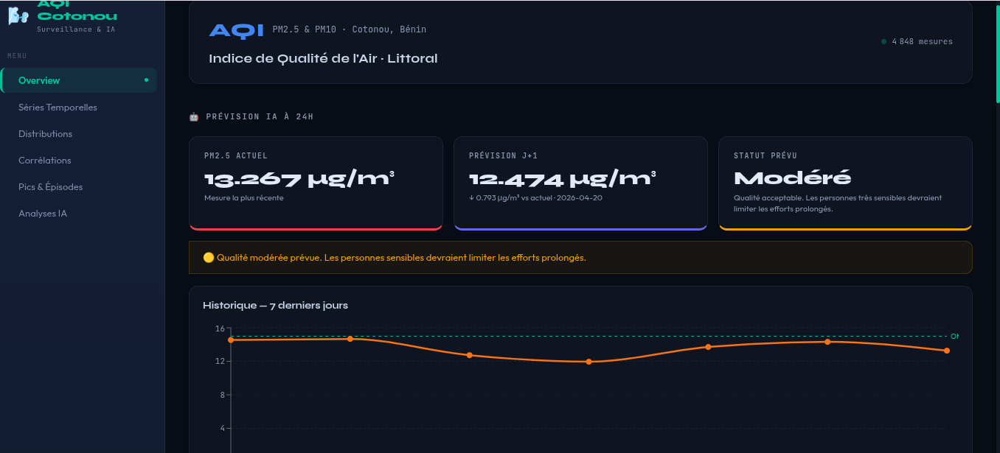
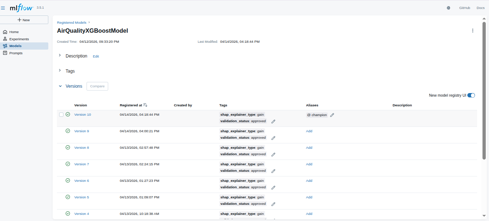

# 🌍 AirQuality Cotonou — Prévision & Analyse de la Pollution 

## 📌 Présentation du Projet
Ce projet vise à prédire et monitorer l'**Indice de Qualité de l'Air (AQI)** pour la ville de **Cotonou (Littoral)**. En combinant la puissance du Machine Learning et une interface web moderne, nous offrons aux citoyens une vision en temps réel de la pollution et des prévisions basées sur des modèles rigoureux.

> **Objectif ML :** Prédire l'AQI avec précision en utilisant XGBoost et expliquer chaque décision du modèle via SHAP/LIME.

## 🚀 Fonctionnalités Clés
* **Prédiction en temps réel :** Algorithme XGBoost optimisé pour les micro-variations climatiques de Cotonou.
* **Explicabilité (XAI) :** Intégration de LIME & SHAP pour comprendre pourquoi l'AQI est élevé (ex: humidité, trafic, température).
* **Dashboard Interactif :** Visualisations avancées avec Recharts (Next.js).
* **IA Insights :** Analyse automatique des données par un agent IA (GPT-5.4-pro) pour donner des recommandations de santé.
* **Système de Notifications (features preview):** Alertes quotidiennes via la Push API pour prévenir les utilisateurs en cas de pic de pollution.

---

## 🛠 Stacks Techniques

| Domaine | Technologies |
| :--- | :--- |
| **Data Science** | Python 3.13, Scikit-learn, **XGBoost**, MLflow ,**Docker** |
| **Explicabilité** | LIME, SHAP |
| **Backend / API** | **FastAPI**, Uvicorn |
| **Frontend** | **Next.js 15+**, Tailwind CSS, Recharts |
| **Déploiement** | Netlify (Frontend), HuggingFaceSpace(Backend API) |
| **Suivi Expériences** | Dagshub / MLflow |

---

## 📊 Expérimentations & Tracking

Le cycle de vie du modèle est entièrement suivi via **MLflow**. Vous pouvez consulter les métriques, les hyperparamètres et les versions du modèle ici :

👉 

## AUTEURS

**Eric KOULODJI Data Scientist & Machine Learning Engineer Founder of DTech-Africa*

*La Mathématique n'est pas un luxe, elle est la preuve vivante de notre existence sur Terre.* 

## CONTACTS

* **Linkedin:** https://www.linkedin.com/in/dona-erick

* **Facebook :** https://facebook.com/dona.eric.koulodji

* **Medium :** https://medium.com/@koulojiric

* **Github :** https://github.com/dona-eric 

UNE SEULE ACTION : 

***Abonnez-vous***

***Follow-me***

***Share***

                 Fait le 20 Avril 2026  ## 30 Days ML Math Challenge
Mon dépôt pour le challenge de 30 jours sur les mathématiques du Machine Learning.
