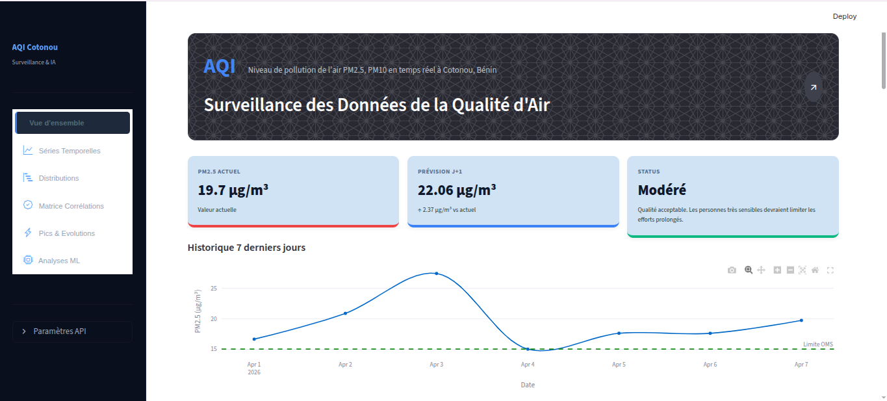

## Projet 2 — Air Quality & Pollution d'air 

Objectif ML : Prévoir l'indice de la qualité d'air(AQI) dans la ville de Cotonou (Littoral).

De ce fait nous apprendrons ensemble comment :

* **Déployer un modèle de Machine Learning via FastAPI**

* **Créer un mini site web **Streamlit | Render** pour la production**

---

## STACKS TECHNIQUES À UTILISER

* **Python 3.13 | Other Version**

* **Git & Github | Gitlab**
* **Numpy, Pandas, Matplotlib, Seaborn, LIME & SHAP**
* **Streamlit** (Latest version)
* **Sklearn** (Bibliothèque de Machine Learning)
* **Jupyter | Anaconda**
* **FastAPI** (Librairie Python pour créer une **API**)

## AUTEURS

* ***Nom & Prenoms :*** **Eric KOULODJI**

* ***Profil :*** **Data Scientist, Machine Learning Engineer**

### **Founder of DTech-Africa**

*La Mathématique n'est pas un luxe, elle est la preuve vivante de notre existence sur Terre.* 

### CONTACTS

* **Linkedin:** https://www.linkedin.com/in/dona-erick

* **Youtube :** 

* **Facebook :** https://facebook.com/dona.eric.koulodji

* **Medium :** https://medium.com/@koulojiric

* **Github :** https://github.com/dona-eric 

UNE SEULE ACTION : 

***Abonnez-vous***

***Follow-me***

***Share***

                 Fait le 24 Février 2026# 30 Days ML Math Challenge
Mon dépôt pour le challenge de 30 jours sur les mathématiques du Machine Learning.
